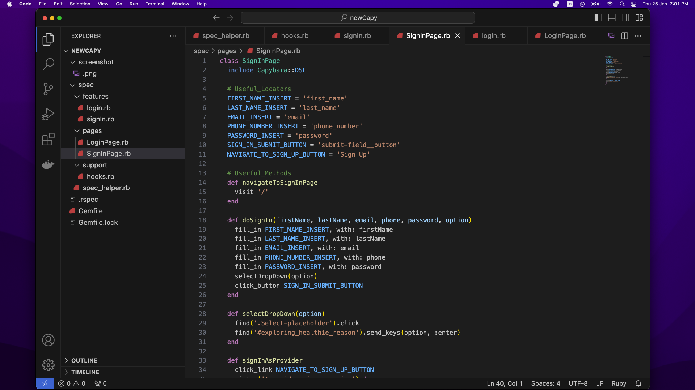
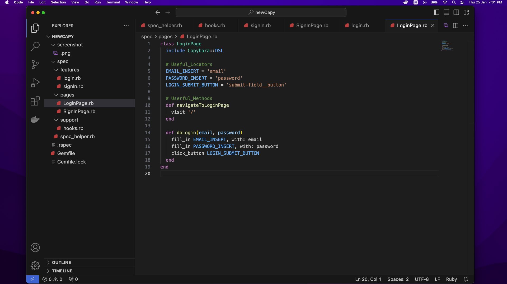
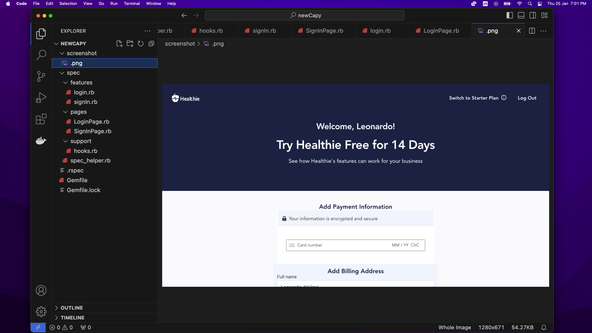
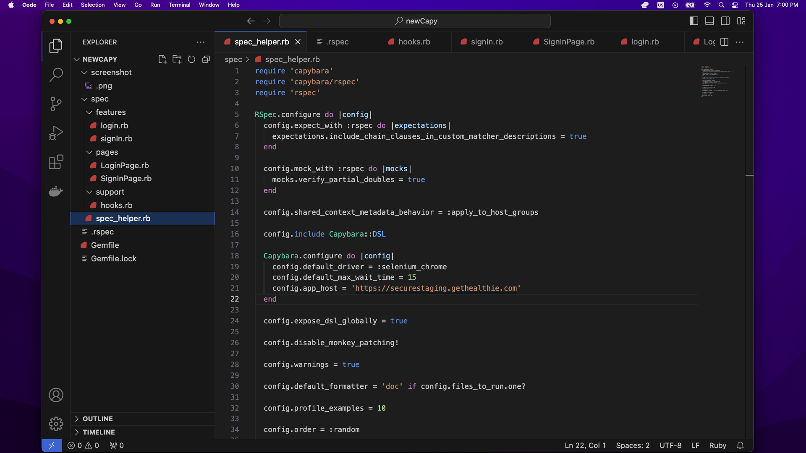
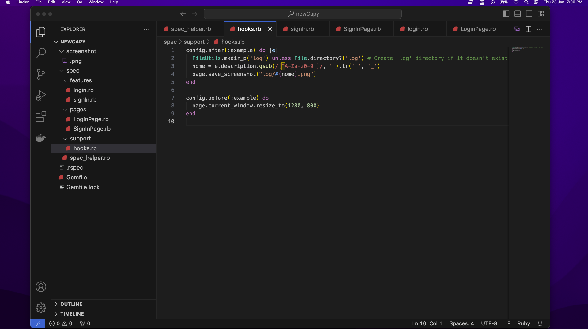
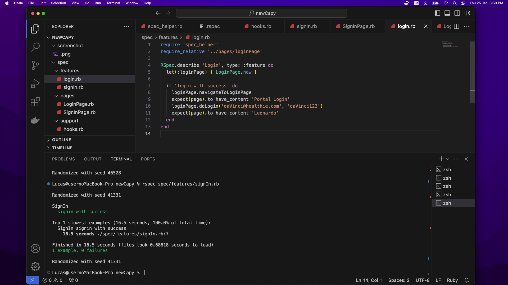
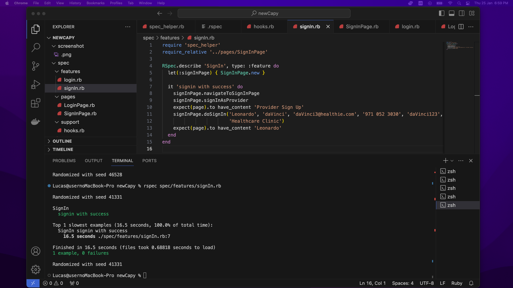

# RSPEC - Capybara Challenge

Hi there, please find here the required Steps to reproduce the test cases and report.

Pre-requisites:
-  Project should be downloaded/cloned from shared link of GitHub;
-  Please ensure Chrome Driver is available and installed at the right path.

---------------

<h3>Steps to Run the Test Scenarios</h3>

1. Download and Open the project folder inside of VSCode;
2. Open the Terminal inside of VSCode and Run the command: rspec spec/features/login.rb for Login Scenario
3. Open the Terminal inside of VSCode and Run the command: rspec spec/features/signin.rb for SignIn Scenario

If the dependencies are correctly installed, the test scenarios will be executed.

---------------

<h3>Project Explanation</h3>
1. I used pageObjects pattern to organize the project files;

2. I created 3 main folders: Features, Pages and Support.

3. Inside of Features Folder we can find the specs - test cases. 

4. Inside of Pages Folger we can find the locators and methods.

5. Inside of Support we can see the used Hooks.

6. BaseURL is placed in spec_helper file as well as driver info.

7. I organized the locators into variables and made use of parameters inside of the methods in order to reuse and make the code dry.

8. For the login scenario I prepared proper data in order to proceed the login validation.

9. For the login scenario I put assertions to make sure we are at the right page and to make sure the login was successful.

10. For the SignIn scenario I used the methods from SignIn Page and just inserted the data to do Login with success.

11. Assertion was placed to make sure the right page was displayed and filled, as well as to ensure the SignIn process was completed properly.

12. Screenshot was defined inside of Hook to be captured after test execution.

---------------

<h3>    Please, find attached the Project Structure and Screenshots of the created code. </h3>

<h4>
SignIn Page:
   

<h4>
Login Page:
   

 
  
<h4>
ScreenShot:
   

 

<h4>
Spec_Helper:
   

  

<h4>
Hooks:
   

  

<h4>
Login:
   

  

<h4>
SignIn:
   

  
